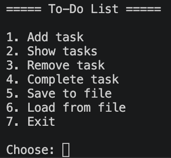

# To-Do List App

A simple command-line To-Do List application built with Python.

## Features

- Add tasks
- Show tasks
- Complete tasks
- Remove tasks
- Save tasks to a file
- Load tasks from a file

## Screenshot



## Technologies

- Python

## How to Run

```bash
python3 todo_list.py
```

